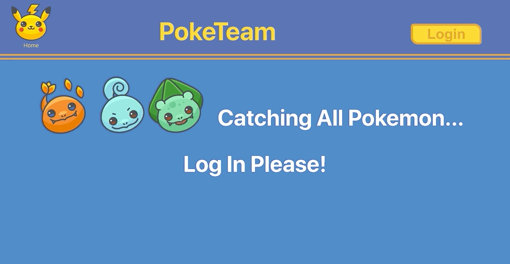
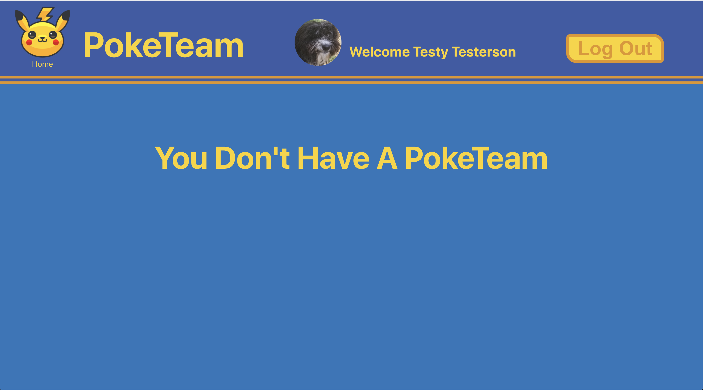
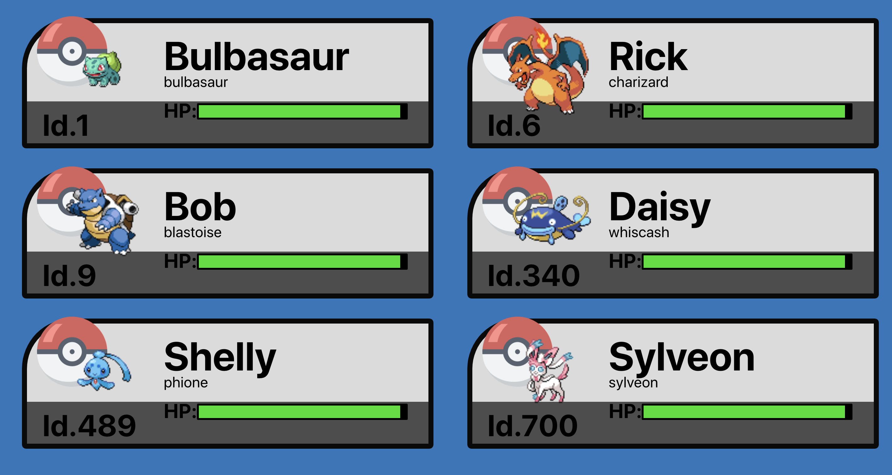

# Stretch-Auth
**Mod 3 Pair Project**  

### Authors

**Jordan Shryock**
 * [GitHub](https://github.com/jordy1611)
 * [LinkedIn](https://www.linkedin.com/in/jordan-shryock-6a48b9113/)

**Horacio Borrego**
 * [GitHub](https://github.com/H-Bo214)
 * [LinkedIn](https://www.linkedin.com/in/horacio-borrego-4a52851b0/)
 
**Ben McClung**
 * [GitHub](https://github.com/AurumValian)
 * [LinkedIn](https://www.linkedin.com/in/benjamin-mcclung-1a1a4b1b6/)

**Naomi Ware**  
 * [GitHub](https://github.com/nware1066)
 * [LinkedIn](https://www.linkedin.com/in/naomi-ware-083332b8/)
 
### Overview  
PokeTeam is an application which allows users to login using a google account and build a team picked from over 800 Pokemon. This was the first project at Turing to impliment a new technology (Google Firebase) with and API of our choosing (PokeAPI). 

### Technologies and Tools Used
- React
- React Router
- Jest
- Google Firebase
- Git VCS
- GitHub Projects

### Installation Instructions

**Front-end**
- Clone down this repo
- Run `npm install` from the root directory
- Run `npm start` and visit localhost:3000 in your browser

### App Demo

* User sees a loading page first time visiting the page

* User can login in using their Google account

* If a user does not have a poketeam they are prompted to build one

* A user can catch a pokemon by typing in it's pokemon id number or name. User can also give the pokemon a name.

* A user can release a pokemon by clicking it's poke sprite/image.

* User can view their PokeTeam on the homepage

### Credits
* All Pokemon data from [PokeApi](https://pokeapi.co/)
* Icons made by [Smashicons](Smashicons) via [Flaticon](www.flaticon.com)
* Icons made by [Roundicons Freebies](https://www.flaticon.com/authors/roundicons-freebies) via [Flaticon](www.flaticon.com)
